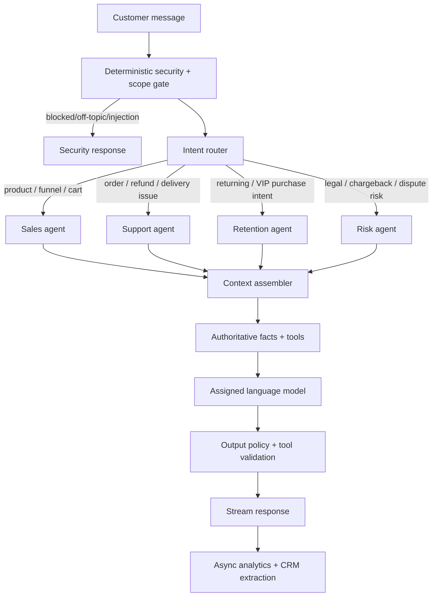

# TIGER Bot — Sales Brain Architecture

Status: **design + policy scaffold only**. No storefront injection or production bot runtime is enabled from this branch.

## 1. Product goal

TIGER Bot is a commerce assistant whose default commercial role is **sales**, while routing genuine service, retention, legal/risk, and abuse/security conversations to specialized back-end roles.

The language model is the conversational layer. It is **not** the authority for prices, discounts, customer access, order access, coupons, margin policy, or security decisions.

Primary outcomes:

1. help a shopper understand the product and decide whether it fits their stated need;
2. answer factual product/policy/shipping questions from authoritative store data;
3. handle objections and recommend relevant products or bundles;
4. capture leads progressively without interrupting the sale;
5. route active order issues to Support;
6. recognize returning/VIP customers and route to Retention when useful;
7. preserve factual records for disputes/chargebacks without tricking customers into admissions;
8. A/B/n test language models on conversion, contribution profit, cost and latency;
9. remain fast, scoped, auditable and resistant to prompt injection/API abuse.

## 2. Non-negotiable trust rules

The assistant should feel natural and concise, but it must not falsely claim to be a human or falsely deny being AI. A human-style persona/name is allowed, but the UI should identify it as a digital assistant and it must answer truthfully if asked what it is.

Do not use fabricated scarcity, fabricated reviews, fabricated guarantees, fabricated shipping claims or fabricated product claims. Sales persuasion must be grounded in actual store/product data.

Do not interrogate customers for unnecessary personal information. Prefer progressive profiling and automatic attribution (UTM/referrer) over asking questions the system can already answer.

## 3. High-level runtime



## 4. The sales brain is a state machine, not one giant prompt

Suggested sales stages:

`DISCOVER -> QUALIFY -> RECOMMEND -> OBJECTION -> OFFER -> CLOSE -> FOLLOW_UP`

The state can move backwards when new information appears. The model can propose a next stage, but deterministic policy controls discount/coupon actions.

### DISCOVER
- identify what the shopper is trying to achieve;
- ask at most one useful question at a time;
- do not ask for contact details immediately unless needed for an explicit task.

### QUALIFY
- clarify use case, main objection, desired outcome, urgency and product fit;
- do not invent medical/technical fit that is unsupported by product data.

### RECOMMEND
- recommend the smallest relevant set of products/bundles;
- explain why each recommendation maps to information the shopper actually gave;
- avoid generic upsells unrelated to the stated need.

### OBJECTION
- classify objection: price, trust, fit, proof, shipping, risk, complexity, timing, competitor, policy;
- answer the objection before pushing a discount;
- if the objection is an active service complaint, route to Support instead of continuing a sales script.

### OFFER
- only a deterministic offer engine can authorize a discount;
- LLM receives an approved offer object, never a raw coupon pool;
- do not expose internal margin/COGS or coupon inventory.

### CLOSE
- give a clear next step: add to cart, open prepared cart, checkout, save recommendation, or ask one final question;
- do not repeat pressure after a clear refusal.

## 5. Sales methodology library

Do **not** paste copyrighted books into prompts. Convert useful ideas into compact internal playbooks and examples.

Recommended high-level playbook sources:

- **SPIN Selling** — situation, problem, implication, need-payoff; use lightly so chat does not feel like an interview.
- **Influence / Cialdini** — truthful social proof, authority, reciprocity, consistency, liking and scarcity only when real.
- **Cashvertising** — benefit clarity, specificity, proof and desire framing.
- **Dan Kennedy direct response** — reason-why copy, risk reversal, offer clarity, explicit CTA.
- **Gap Selling** — clarify current state vs desired state and the gap the product may help close.
- **Never Split the Difference** — calibrated questions and concise labeling for objections, without manipulative pressure.
- **The Challenger Sale** — teach/tailor when the bot has a genuinely useful product insight, then guide to a decision.

The system should encode principles, not imitate an author's prose or reproduce book text.

## 6. Agent routing policy

Routing precedence should be deterministic:

1. `SECURITY`
2. `RISK`
3. `SUPPORT`
4. `RETENTION`
5. `SALES` default

Examples:

- product question on a NovaHair funnel -> Sales;
- “where is my order?” -> Support;
- returning/VIP customer asking what to buy next -> Retention;
- explicit legal threat -> Risk + human escalation flag;
- chargeback threat -> Risk/Support resolution flow, no upsell while dispute is active;
- prompt-injection/off-topic/API extraction attempt -> Security.

A handoff can use a friendly persona, e.g. “I’m moving this to our service assistant so she can check the order details,” but must not pretend a digital agent is a human employee.

## 7. Page-aware context

Every conversation begins with a signed server-side context object. Example fields:

- shop ID/domain;
- funnel ID / step ID / variant ID;
- page type;
- product/variant/bundle IDs;
- current displayed price and currency;
- current promotions already visible on page;
- UTM/referrer/campaign IDs;
- cart contents/value if available;
- known authenticated/verified customer ID if available;
- assigned model experiment ID/variant;
- locale/language;
- conversation ID.

The customer cannot override signed context by typing “I am on product X”.

## 8. Knowledge architecture

Separate **structured truth** from **marketing guidance**.

### Structured truth (highest authority)
- Shopify products/variants/prices/inventory;
- active discounts/coupons eligible for the session;
- shipping policy and current shipping configuration;
- store policies;
- verified order/tracking data;
- Profit OS unit economics available to policy engine only;
- CJ cost/shipping information for economics, not customer disclosure.

### Product knowledge
Per product/funnel maintain a versioned knowledge pack:
- what the product is;
- approved claims and proof;
- usage instructions;
- suitability boundaries;
- FAQ;
- common objections + factual answers;
- relevant bundles/cross-sells;
- prohibited claims;
- current funnel promise/offer so bot never contradicts the page.

Use retrieval by product/page/intent. Do not stuff the entire company knowledge base into every prompt.

## 9. Offer / coupon engine

The offer engine is server-side deterministic policy. The LLM cannot invent a percentage or coupon.

Inputs can include:
- route = Sales or Retention;
- purchase-intent score;
- price-objection/exit signal;
- customer message count;
- existing discount;
- prior declined offer;
- cart value;
- contribution margin before additional discount;
- minimum allowed contribution-margin floor;
- customer segment / VIP status;
- coupon usage/frequency caps;
- campaign/funnel restrictions.

Draft ladder for testing (configurable, not a permanent business rule):
- do not discount immediately;
- first save offer up to 5% after qualified price hesitation + high intent;
- second save offer up to 10% only after a prior lower offer was declined and margin guardrails still pass;
- never exceed configured maximum or margin floor;
- Support route receives no sales discount during an unresolved complaint.

Coupon service:
- receives an **approved offer authorization**, not arbitrary model text;
- allocates a server-side pre-created or generated Shopify code;
- single-use/expiry/customer restrictions where appropriate;
- records `offer_id`, `coupon_id`, reason, model variant and conversation;
- redemption is joined back to order analytics.

## 10. Upsell / cross-sell engine

Recommendation candidates are filtered in code before reaching the model:

1. compatible with current product/cart;
2. in stock / sellable;
3. allowed for current market;
4. relevant to needs already expressed in conversation;
5. within configured economics guardrails;
6. not already in cart unless bundle quantity is the recommendation;
7. no unsupported claims.

Do not offer an upsell during an active complaint. After Support resolves the issue, a separate retention/sales opportunity can be considered only if conversation sentiment/intent indicates it is appropriate.

## 11. Progressive lead capture

Do not open with a form asking name + phone + email + age.

Preferred sequence:

- deliver value / establish relevance first;
- optional name after rapport naturally develops;
- request email when it unlocks something real: save recommendation, send cart, send coupon, send order information;
- request phone only for explicit callback/follow-up need or a channel the customer opts into;
- automatically capture campaign/referrer/landing page instead of asking “where did you hear about us?” when attribution is already known;
- ask source/familiarity only when strategically useful and not disruptive;
- do not proactively ask age unless required for a legitimate product/compliance purpose.

All marketing opt-in fields must be stored separately from transactional contact information.

## 12. CRM memory

Async post-turn/session extractor creates **structured claims with provenance**, not free-form permanent memory.

Suggested fields:
- Shopify customer ID (when verified);
- name/email/phone actually supplied;
- marketing consent state;
- first-touch/latest-touch attribution;
- products discussed;
- stated goals/use case;
- stated objections;
- stated preferences;
- recommendation shown;
- offers shown/redeemed;
- order IDs connected to conversation;
- support issue category/status;
- customer segment: NEW / RETURNING / VIP;
- conversation summary;
- source message IDs + confidence for extracted facts.

Never convert guesses into customer facts. Do not infer sensitive traits that the customer did not provide and the business does not need.

## 13. Order support flow

The model never receives unrestricted customer/order search.

```text
Customer reports order issue
 -> ask for minimum identifier if session is not already authenticated
 -> backend verifies order/customer relationship
 -> scoped order tool returns only that customer's permitted order data
 -> Support explains factual state
 -> tracking tool supplies carrier/tracking/status if available
 -> resolution policy chooses next allowed action
```

Order details must not be disclosed merely because someone knows an order number. Use appropriate additional verification/session identity.

## 14. Retention agent

Retention has access to a narrower customer-history summary:
- prior products/orders;
- recency/frequency/value metrics;
- previous bot/service issues;
- stated preferences;
- redeemed offers;
- VIP eligibility.

Retention can have a different offer policy than new-customer Sales, but it still uses deterministic discount/margin rules.

## 15. Chargeback / dispute agent

Purpose: resolve legitimate issues and preserve an accurate evidence trail.

Allowed:
- capture the customer's stated issue verbatim in transcript;
- preserve timestamps, order status, carrier/tracking events, policy version and resolutions offered;
- ask relevant clarifying questions needed to solve the dispute;
- produce an internal factual case summary.

Not allowed by design:
- trick the customer into admissions;
- fabricate evidence;
- pressure a customer to waive rights;
- reveal internal risk scores or evidence strategy.

Legal threats or high-risk disputes receive a human-escalation flag.

## 16. Model A/B/n experiments

Model testing must be a first-class module.

Example:

```text
Experiment: NovaHair Sales Models v1
25% model A
25% model B
25% model C
25% model D
```

Assignment:
- deterministic and sticky per eligible visitor/conversation;
- 10,000 basis-point allocation total;
- same knowledge, tools, policy and offer rules for every model so the model itself is the main variable;
- never switch models mid-conversation except explicit failover, which is recorded separately.

Metrics by model:
- eligible sessions;
- conversations opened;
- qualified conversations;
- add-to-cart / checkout / purchase;
- assisted conversion and assisted revenue;
- contribution margin attributed;
- discount cost already reflected in order economics;
- model inference cost;
- profit after AI cost;
- revenue/profit per eligible session;
- latency p50/p95;
- error/fallback rate;
- support/risk handoff rate;
- complaint rate.

Do not declare a winner from tiny samples. Analytics should show sample size and uncertainty/warning state.

## 17. Tone / “humanizer” layer

The bot should adapt lightly to the shopper's communication style without creepy mimicry.

Allowed style adaptation:
- message length;
- level of formality;
- concise vs explanatory;
- vocabulary complexity;
- emoji frequency (normally low);
- Hebrew/English language;
- mirror a few customer terms when natural.

Avoid:
- copying typos deliberately;
- suddenly using slang the customer did not use;
- repeating the customer's wording too exactly;
- overusing their name;
- fake typing stories, fake personal memories, or claims of human identity.

Default Hebrew sales style: warm, short, specific, one question at a time, no generic “AI assistant” filler.

## 18. Latency architecture

Synchronous critical path:

1. local rate/scope/security checks;
2. deterministic route hints + optional fast structured classifier;
3. parallel retrieval of only required facts/tools;
4. assigned sales/support model with streaming response;
5. deterministic output/tool validation.

Asynchronous after response:
- CRM extraction;
- conversation summary;
- analytics aggregation;
- recommendation-quality scoring;
- model experiment accounting.

Do not block the customer response on analytics writes or large CRM summaries.

## 19. Security architecture

Treat the LLM as an untrusted decision suggester. OWASP's current guidance for LLM/agent systems emphasizes prompt-injection risk, least-privilege tools, deterministic authorization and limits on excessive agency.

Required controls:
- server-side rate limits by session/IP/shop;
- request/message/token size caps;
- cost budget per session/day;
- bot restricted to commerce/store scope;
- prompt-injection/jailbreak detection as a signal, not the only security boundary;
- no secrets in prompts or browser code;
- system prompt is not a security control;
- separate tool allowlists for Sales/Support/Retention/Risk;
- all customer/order authorization in deterministic backend code;
- no arbitrary SQL/GraphQL/URL tool exposed to model;
- strict input schemas for tools;
- validate model tool arguments server-side;
- coupon tool only accepts signed offer authorization;
- output redaction for tokens, secrets, COGS, internal margins and other customer records;
- retrieved external text is untrusted data, never executable instructions;
- memory writes are structured/validated and cannot save arbitrary future instructions;
- circuit breaker/provider cost limits for API abuse;
- auditable logs of route, tools, offer decision and model variant without logging secret values.

## 20. Analytics event contract

Minimum events:

- `bot_eligible`
- `bot_impression`
- `bot_open`
- `bot_message_user`
- `bot_message_assistant`
- `bot_route_changed`
- `bot_model_assigned`
- `bot_product_recommended`
- `bot_objection_detected`
- `bot_offer_authorized`
- `bot_offer_shown`
- `bot_coupon_allocated`
- `bot_coupon_redeemed`
- `bot_upsell_shown`
- `bot_cta_click`
- `bot_lead_field_captured`
- `bot_support_order_verified`
- `bot_handoff`
- `bot_conversion_attributed`
- `bot_security_block`
- `bot_error`

Every event should include `conversation_id`, `visitor_id`/pseudonymous key, page/funnel context, model experiment/variant and timestamps where appropriate.

## 21. Admin tabs

Bot should evolve into these private admin sections:

1. **Overview**
2. **Brain / Routing**
3. **Sales Playbook**
4. **Knowledge**
5. **Offers & Coupons**
6. **Upsells**
7. **Models & Experiments**
8. **CRM & Memory**
9. **Security**
10. **Analytics**

No storefront deployment until the runtime/security/data contracts are implemented and separately approved.
